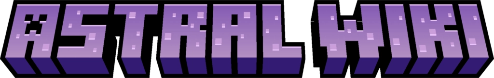

<div align="center">
    
</div>

<p align="center">
    <a href="CONTRIBUTING.md#pull-requests"></a>
    <a href="https://github.com/prettier/prettier"></a>
    <a href="https://discord.gg/mNeHyuZdqm"></a>
    <a href="LICENSE"></a>
</p>

# What is Astralopedia?

Astralopedia is an unofficial wiki for Create: Astral which is built with
[Docusaurus](https://docusaurus.io/)

# Installation

## Requirements

-   [Bun](https://bun.sh/)

## Building

1. Clone this repository from
   [GitHub](https://github.com/Astralopedia/Astralopedia)

```shell
git clone https://github.com/Astralopedia/Astralopedia
```

2. Download dependencies

```bash
cd Astralopedia
bun install
```

3. Build

If you want to build and serve it locally, run:

```bash
bun start
```

It'll start a server at `https://localhost:3000`.

For production, run:

```bash
bun run build
```

> After the command is executed successfully, there will be a `/build` directory
> which contains all you need for deploying

4. Serve it

```bash
bun serve
```

## Credits:

-   All images in [homepage](https://astral.toby7002.dev/) belong to Create:
    Astral

## License

Licensed under the [MIT](./LICENSE) license.
